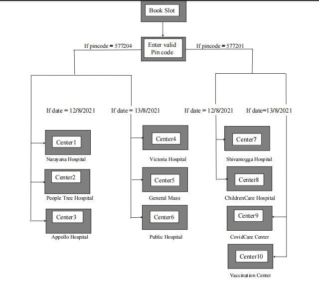

The application will help the user to find vaccination centers based on pincode of the city.                                                                                                                                               
The application uses FireBase as its database collection.  

                   Figure representing the flowchart of vaccine booking
                   
     

                 Figure representing the various centers displayed according
                              to the pincode and date entered
